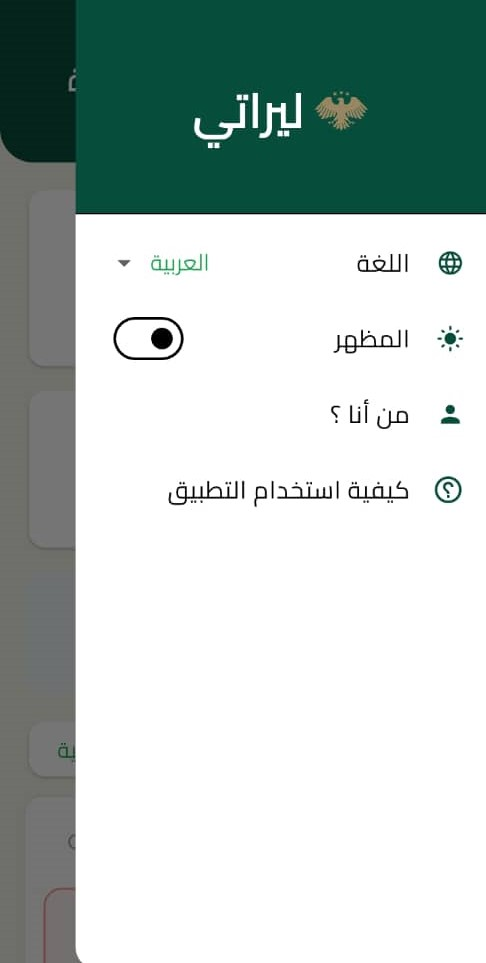
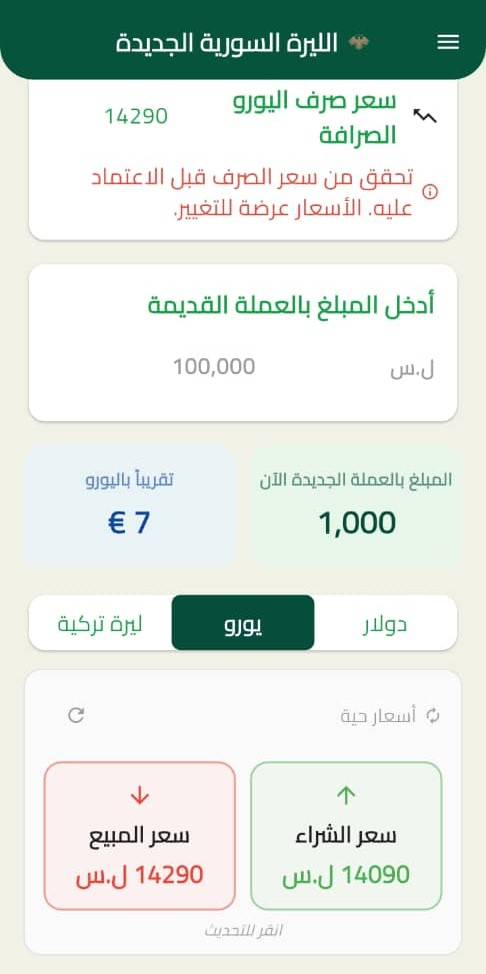
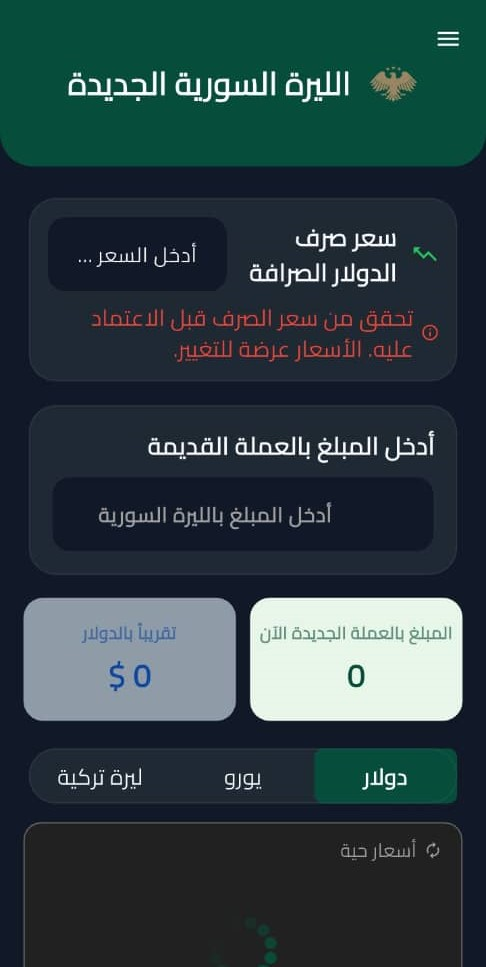

## 🚀 Lirati — First Release
Welcome to the first official release of Lirati 🎉
A modern, lightweight mobile application built with Flutter, designed to help users track real-time exchange rates easily and accurately.

Lirati aims to be your daily companion for monitoring currency values and performing quick conversions with a clean UI and smooth performance.

## ✨ Features
📊 Live Exchange Rates
Track the current Lira exchange rate against major currencies with high accuracy and frequent updates.

🧮 Smart Currency Calculator
Instantly convert between currencies using a fast, simple, and intuitive calculator.

🌙 Modern & User-Friendly Interface
Clean UI focused on clarity and comfort, with Dark Mode support.

⚡ High Performance & Lightweight
Optimized for speed, low battery usage, and minimal data consumption.

🔄 Smooth User Experience
Fast navigation, responsive screens, and a scalable architecture for future features.

## 📱 Built With Flutter Dart

REST APIs (for exchange rates)

Clean & scalable project structure

## 📸 Screenshots
Below are some screenshots from the first release of **Lirati**.

<p align="center">
  <br>
  <em>Splash screen — first impression</em>
</p>

<p align="center">
  <br>
  <em>Who I Am — about / developer page</em>
</p>

<p align="center">
  <br>
  <em>Main Drawer — app navigation menu</em>
</p>

<p align="center">
  
  &nbsp;&nbsp;
  <br>
  <em>Home screen — Light Mode (left) & Dark Mode (right)</em>
</p>


##📥 Download APK
Click the link below to download the APK file directly:

👉 [Download APK Here](https://dub.sh/lirati) 👈

## ⚠️ Important Note
Since this is the first release and the app is not yet published on Google Play, you may see a warning from Google Play Protect.
This is normal. Please select "Install anyway" to continue.

## 🛠️ Getting Started (For Developers)
```bash
flutter pub get
flutter run
```
Make sure you have Flutter SDK installed and a connected device or emulator.

## 🤝 Contributing
Contributions, suggestions, and feature requests are welcome.

1-Fork the repository
2-Create a new branch
3-Commit your changes
4-Open a Pull Request

## 📬 Contact
Developed by Abd Alghani Soud
GitHub: https://github.com/abd-alghani-soud
Email: abdalghanisoud21@gmail.com

Thank you for using Lirati 💙
Your feedback will help shape future updates.
